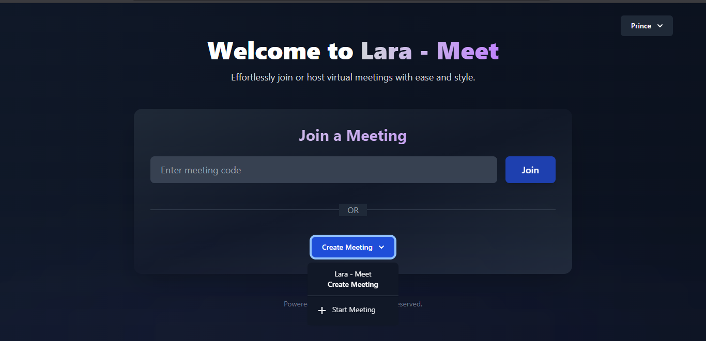
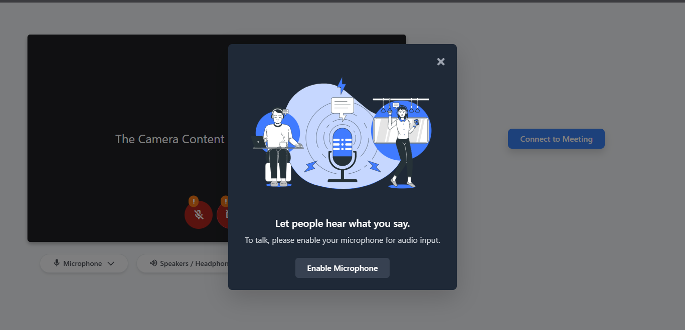

```markdown
# Lara Meet

**Lara Meet** is a Laravel-based web application that emulates the core functionalities of Google Meet, enabling real-time one-to-one video conferencing using WebRTC and Laravel Echo.

---

## 📌 Features

- 🎥 One-to-one video calling using WebRTC
- 📡 Real-time signaling with Laravel Echo and Pusher
- ⚛️ UI powered by React and Tailwind CSS
- ⚙️ Livewire integration for dynamic components
- 🔐 Secure and scalable structure

---

## 🛠️ Tech Stack

- **Backend**: Laravel (PHP)
- **Frontend**: React.js, Tailwind CSS
- **Real-Time**: WebRTC, Laravel Echo, Pusher
- **Build Tools**: Vite, PostCSS
- **Extras**: Livewire, Navigator API

---

## 🚀 Installation

### Prerequisites

- PHP >= 8.0 (Preffered)
- Composer
- Node.js and npm
- MySQL or any other supported DB
- A [Pusher](https://pusher.com) account

### Steps

1. **Clone the repo**

   ```bash
   git clone https://github.com/princevora/lara-meet.git
   cd lara-meet
   ```

2. **Install PHP dependencies**

   ```bash
   composer install
   ```

3. **Install Node dependencies**

   ```bash
   npm install
   ```

4. **Setup `.env` file**

   ```bash
   cp .env.example .env
   ```

   Fill in database and Pusher credentials in the `.env` file.

5. **Generate app key**

   ```bash
   php artisan key:generate
   ```

6. **Run migrations**

   ```bash
   php artisan migrate
   ```

---

## ⚙️ Configuration

### WebSockets With Reverb

```bash
php artisan install:broadcasting
```

Install Dependencies For NPM Too.
(will be asked while installing broadcasting)

---

## 🧪 Run the Application

```bash
php artisan serve
npm run dev
php artisan reverb:start --debug 
```

Open your browser at: [http://localhost:8000](http://localhost:8000)

---

## 🧭 Usage

- Click **"Start Meeting"** to generate a room
- Share the link with a friend
- Open the link in another browser/device to join
- Allow **camera** and **microphone** access when prompted

---

## First Look
# Starting An Instant Meeting


# Joining A Meeting


---

## 🤝 Contributing

1. Fork this repo
2. Create a feature branch:
   ```bash
   git checkout -b feature/amazing-feature
   ```
3. Make changes and commit:
   ```bash
   git commit -m "Add amazing feature"
   ```
4. Push to GitHub:
   ```bash
   git push origin feature/amazing-feature
   ```
5. Open a Pull Request

---

## 📄 License

This project is licensed under the [MIT License](LICENSE).
---

> Developed with ❤️ by [Prince Vora](https://github.com/princevora)